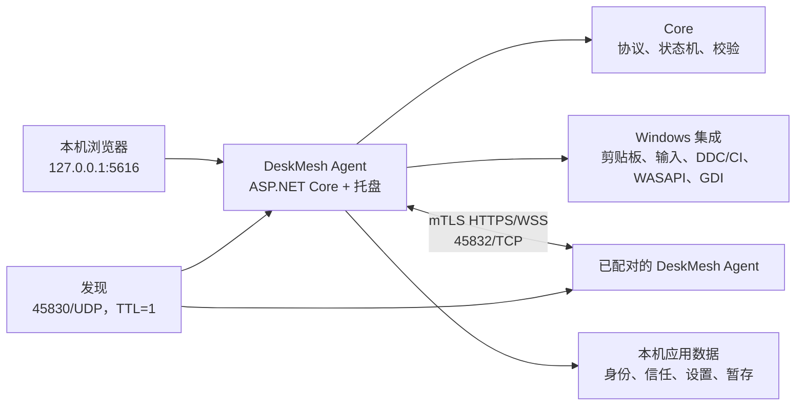

# DeskMesh（桌联）架构

本文描述 `0.1.x` Alpha 的逻辑架构。DeskMesh 是两台 Windows 电脑之间的本地优先协作工具，不依赖云端控制面或中继。

## 设计原则

1. **控制面留在本机**：中文网页只监听 `127.0.0.1:5616`。
2. **局域网数据面先鉴权**：设备连接使用双向 TLS、设备证书指纹固定和已配对身份。
3. **每条能力独立设边界**：键鼠、剪贴板、文件、显示器、画面和音频使用独立协议与尺寸/速率边界；当前配对仍是设备级信任。
4. **输入故障时 fail-open**：会话断开、超时或撤销信任后释放按键并恢复本机输入。
5. **高吞吐不积压旧数据**：远程画面优先发送最新帧，慢消费者不应形成无限队列。
6. **硬件结果必须验证**：DDC/CI 命令返回不等同于显示器已经切源。

## 组件



### Agent 与本地网页

`LanSwitch.Agent` 是当前源码项目和命名空间的兼容名称，发布程序集与可执行文件名为 `DeskMesh`。该项目承载 WinForms 托盘、ASP.NET Core 本地 API、静态 React 控制台和设备协议端点。本地页面通过同源 API 和事件通道读取状态，不直接访问 Windows 剪贴板或输入设备。

### Core

`LanSwitch.Core` 包含不依赖 Windows UI 的协议模型、配置、剪贴板去环、文件摘要校验和焦点切换状态机。这些规则应尽量保持纯逻辑，便于在 CI 中覆盖失败路径。

### Windows 集成

`LanSwitch.Windows` 封装 Win32 能力：

- 低级键鼠钩子、Raw Input 与 `SendInput`；
- STA 剪贴板读取、写入和变更通知；
- Windows DDC/CI 与 MCCS VCP `0x60`；
- WASAPI loopback 系统音频；
- 登录后普通桌面的 GDI 抓屏。

这些能力受 Windows 完整性级别和安全桌面限制，不能控制 UAC、锁屏、登录前、Ctrl+Alt+Del、BIOS 或部分反作弊应用。

## 网络边界

| 端口 | 监听范围 | 用途 |
| --- | --- | --- |
| `5616/TCP` | 回环地址 | 本地中文控制台与本地 API |
| `45832/TCP` | 局域网 | 已配对设备间 HTTPS/WSS 数据面 |
| `45830/UDP` | 局域网，TTL=1 | 自动发现广播/组播 |

公网端口转发、反向代理和跨互联网部署不属于支持范围。自动发现只提供候选地址，不能代替配对和证书验证。

## 主要数据流

### 配对

目标设备生成短时一次性配对码；请求发起后，两边核对安全短语和证书指纹并确认。设备身份私钥由 Windows DPAPI 保护。配对关系变化后，旧信任令牌和会话必须失效。

### 全局键鼠

控制端先确认目标在线并准备输入通道，再释放当前按键并提交带 epoch 的路由。目标只接受当前已提交 epoch 的有序输入。紧急快捷键和网络异常都会触发释放并回本机。

### 两种切换模式

`directSignal` 是默认模式：沿用全局键鼠状态机，并在已校准时执行 DDC/CI 实体信号切换。`seamlessRemote` 是浏览器会话模式：保持显示器输入不变，复用远程桌面的画面、画面内输入和音频通道。Agent 以出站远程桌面会话注册表将浏览器输入与系统级焦点事务互斥；活动会话存在时不能更改模式或开始直接信号切换。两条路径不能同时发送输入；无缝模式不会调用全局焦点切换或显示器组件。

无缝会话在浏览器成功解码并绘制第一帧前保持“连接中”，不会进入控制状态。首帧超时、WebSocket 断开、输入心跳超过两秒、解码失败、用户返回或紧急快捷键都会发送释放消息、清除最后画面并关闭全视口层。由于浏览器负责呈现，无缝模式的远端切换快捷键仅由已打开、可见且获得焦点的本地控制台标签响应；事件携带唯一请求 ID，多个标签通过按请求加锁的浏览器 Web Locks 只允许一个标签认领，且不能静默回退成实体切源。

### 剪贴板与文件

剪贴板使用来源、序号和摘要避免 A→B→A 循环。文件不会自动随剪贴板发送：发送方选择文件，接收方确认保存位置，传输写入 `.part`，完成 SHA-256 校验后再提交正式文件。

### 显示器联动

每台 Agent 探测本机所见的物理显示器并保存设备到输入源值的映射。切源流程区分“命令已发送”和“读回已验证”。切源后 DDC 通道消失时，另一台 Agent 可提供连续稳定读数，但实体摇杆始终是最终恢复手段。

### 远程桌面与音频

浏览器创建随机远程桌面会话，Agent 通过已配对 WSS 代理选定屏幕的 JPEG 帧和画面内输入。视频、输入和系统音频是独立数据面，共享同一可撤销会话身份；单一数据面失败不应无条件终止其他数据面。

最高 90 FPS 是实验目标。实际值受 GDI 抓屏、JPEG 编码、分辨率、CPU 和网络影响；实现优先丢弃陈旧帧，而不是牺牲延迟追赶积压。

## 源码布局

```text
app/                         React 页面与样式
web/                         Vite 入口和本地开发代理
src/LanSwitch.Agent/         托盘、Web/API、设备协调服务
src/LanSwitch.Core/          平台无关模型和状态机
src/LanSwitch.Windows/       Win32、剪贴板、输入和 DDC/CI
tests/                       Core、Agent、Windows 单元/边界测试
scripts/                     本地构建和便携包脚本
docs/                        使用、架构、安全和发布文档
```

安全边界和剩余风险详见 [SECURITY-MODEL.md](SECURITY-MODEL.md)。
