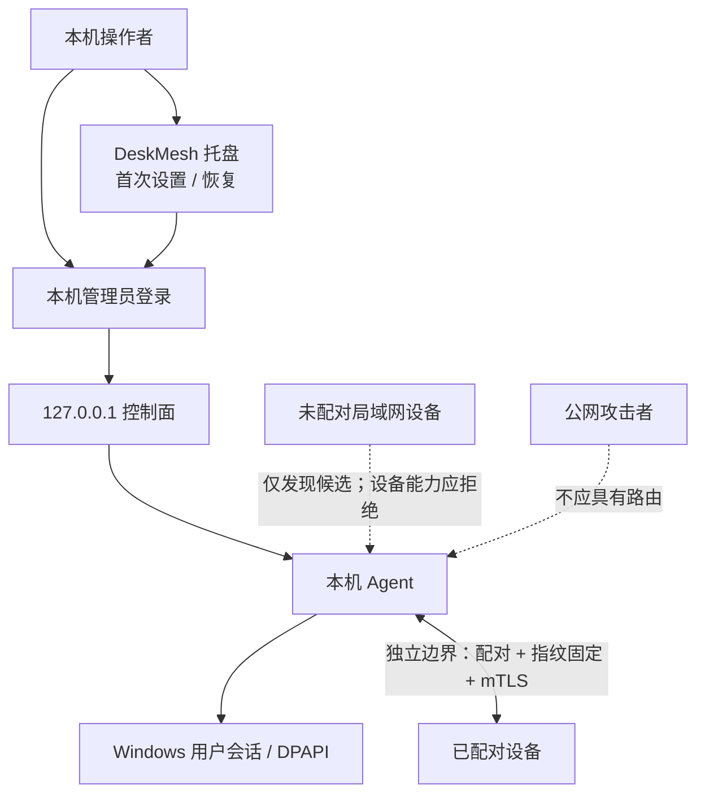

# DeskMesh（桌联）安全模型

本模型用于设计评审和漏洞分类，不构成绝对安全承诺。版本 `0.1.x` 是未签名、未经独立审计的 Alpha。

## 保护目标

- 设备身份私钥和已配对信任关系；
- 用户的剪贴板、文件、屏幕内容和系统音频；
- 键鼠控制权及“可以立即回到本机”的能力；
- 显示器输入映射和切源结果的完整性；
- 本地设置、诊断与暂存文件；
- 本机管理员凭据、会话和首次设置引导。

## 信任边界

本机管理员会话和明确批准的已配对设备是不同的信任主体。管理员认证只保护 `127.0.0.1` 上的网页控制面；设备通信仍由 mTLS、证书指纹和配对目录授权。管理员会话不会作为设备证书使用，已配对设备也不能凭配对关系登录本机网页。

首次管理员设置只能由托盘签发的短时、一次性引导发起，避免其他本机网页抢先注册。管理员凭据损坏时控制面进入恢复状态，不会静默退回为无密码状态；恢复必须在托盘确认。恢复只重置管理员凭据和网页会话，不删除设备身份、配对关系或显示器映射。

旧版本升级后若尚无管理员凭据，控制面进入 `setup-required`，而不是沿用旧的匿名控制状态；现有设备身份、配对关系、显示器映射和其他设置独立保留。已存在但无法解密或校验的管理员凭据进入 `recovery-required`，不能按“尚未设置”处理。

配对不是沙箱：恶意或失陷的已配对设备可能看到用户允许同步的数据。撤销信任只能阻止之后的访问，无法收回对端已经收到的数据。

## 主要威胁与控制

| 威胁 | 主要控制 |
| --- | --- |
| 未配对设备调用能力接口 | 双向 TLS、证书指纹固定、配对目录授权 |
| 中间人替换设备 | 首次配对安全短语/指纹核对，后续固定身份 |
| 旧输入或重复数据包 | 会话 epoch、序号、当前会话检查和撤销令牌 |
| 输入通道中断后卡键 | 发送前释放、目标 pressed-key 跟踪、断线 RELEASE_ALL、紧急回本机 |
| 剪贴板同步循环 | 来源 ID、逻辑序号、内容摘要和尺寸上限 |
| 文件穿越或不完整覆盖 | 文件名规范化、明确保存位置、`.part`、大小上限、SHA-256、完成后提交 |
| 未登录者访问本机控制面 | 仅监听 `127.0.0.1`、本机单管理员认证、服务端 API 门禁、会话超时与主动撤销 |
| 其他本机网页抢先设置管理员 | 托盘签发的短时一次性引导、使用后失效、恢复流程与普通网页分离 |
| 管理员密码猜测与会话滥用 | 密码派生存储、固定时间比较、失败临时锁定、HttpOnly 会话、空闲与绝对到期 |
| localhost 跨站请求或界面诱导 | 严格来源校验、请求令牌、拒绝被嵌入、浏览器安全响应头和请求体上限 |
| 普通用户进程向 UAC 桌面任意注入 | 安全桌面组件默认不安装；安装需 Windows UAC；命名管道固定到当前用户 SID；协议仅允许有界键鼠事件；仅 `Winlogon` 桌面且同会话 `consent.exe` 存在时注入，拒绝命令、路径与任意载荷 |
| 管理员凭据损坏 | 独立版本化存储、DPAPI、损坏时 fail-closed、仅托盘可确认重置 |
| 远程画面资源耗尽 | 单入站会话、帧尺寸/FPS 上限、最新帧优先和取消传播 |
| DDC 误切源 | 显式映射、稳定样本、读回验证、只写模式人工确认和实体恢复手段 |
| 诊断或错误泄密 | 对外使用稳定问题描述；详细异常仅进入本机受控诊断/日志并支持脱敏 |

## 不在防御范围内

- 任一设备的 Windows 管理员、内核、驱动或用户会话已经失陷；
- 已在相同 Windows 用户身份下运行的恶意代码、已失陷的浏览器配置，或用户主动运行会绕过新控制面的旧版/篡改版程序；
- 用户主动信任恶意设备，或首次核对时忽略安全短语/指纹不一致；
- 将 `45832/TCP` 暴露到公网、在不可信公共网络使用或禁用系统防火墙；
- 恶意显示器固件、USB 硬件植入、键盘记录器或物理接触；
- 锁屏、登录前、Ctrl+Alt+Del、BIOS/UEFI 及内核/反作弊隔离边界；UAC 仅在用户显式安装可选安全桌面组件后支持固定键鼠转发，且仍须人工决定是否同意；
- DDC/CI 固件违反 MCCS、切源后通道消失或显示器睡眠产生的不确定性。

## Alpha 已知风险

- 官方 Alpha 二进制尚未 Authenticode 签名；下载者必须验证 GitHub Release 的 SHA-256 和 provenance。
- 屏幕采集使用 GDI/JPEG，音频使用 Windows loopback；这些实验通道尚未做跨大量声卡、DPI、HDR 和高刷新率环境的兼容验证。
- 90 FPS 是上限配置，不是性能或时延保证。高负载可能降低实际帧率。
- 项目尚无第三方渗透测试、安全审计或漏洞赏金计划。
- mTLS 保护传输，不会阻止已配对接收端保存、截图或转发已收到的数据。
- DeskMesh 应用管理员不是 Windows 管理员；登录不会提升权限。可选 UAC 组件是独立的 Windows 管理员安装动作，不会自动同意 UAC，也不会扩展到锁屏或登录前桌面。

## 安全部署清单

1. 仅在 Windows “专用网络”允许 DeskMesh，并确认路由器没有公网端口转发。
2. 从 GitHub Release 获取包，核对 SHA-256 和 provenance；首次 Alpha 还应审阅源码或自行构建。
3. 每台电脑都从本机托盘完成首次管理员设置，使用不同于 Windows 登录和其他网站的长密码。
4. 两端保持相同受支持版本，在现场核对配对短语和指纹。
5. 不使用的剪贴板、音频和远程桌面能力保持关闭；仅在需要时发送文件。
6. 保留 `Ctrl+Alt+Shift+Esc` 和显示器实体切源方式。
7. 分享诊断前删除 IP、设备名、文件路径、指纹和用户内容；不得分享管理员密码、会话 Cookie 或一次性设置引导。
8. 发现异常立即锁定本机控制台、撤销设备信任、退出两端 Agent，并按 [SECURITY.md](../SECURITY.md) 私密报告。

## 安全不变量的测试要求

涉及本机管理员认证的改动必须覆盖：普通网页不能首次设置、一次性引导过期与重放、错误密码锁定、会话空闲/绝对到期、主动撤销、凭据损坏 fail-closed，以及托盘恢复后设备身份、配对和映射保持不变。

涉及配对、TLS、输入、剪贴板、文件或远程桌面的改动必须覆盖：未授权身份、旧 epoch、重复包、撤销信任、超限负载、取消和连接中断。测试必须分别验证“网页管理员会话”和“peer mTLS 身份”，不能让任一边界替代另一边界。硬件相关逻辑应把“策略”和“实际 Win32 调用”分离，以便 CI 验证安全决策。

涉及 UAC 安全桌面组件的改动还必须覆盖：非法参数、非当前用户命名管道、协议版本与大小上限、普通桌面拒绝、按键释放幂等、每用户/实例安装路径隔离，以及发布包只包含单个最小桥接可执行文件。CI 不自动安装系统服务；真实 UAC 测试必须在隔离的 Windows 测试机上人工批准。
