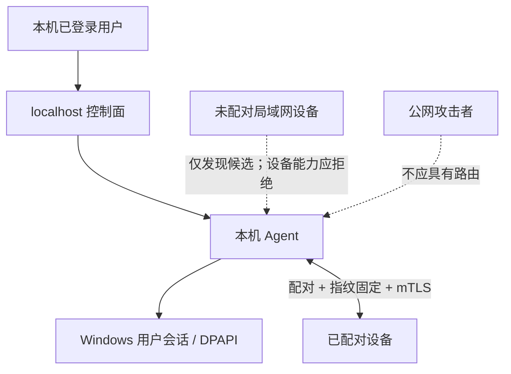

# DeskMesh（桌联）安全模型

本模型用于设计评审和漏洞分类，不构成绝对安全承诺。版本 `0.1.x` 是未签名、未经独立审计的 Alpha。

## 保护目标

- 设备身份私钥和已配对信任关系；
- 用户的剪贴板、文件、屏幕内容和系统音频；
- 键鼠控制权及“可以立即回到本机”的能力；
- 显示器输入映射和切源结果的完整性；
- 本地设置、诊断与暂存文件。

## 信任边界

本机已登录用户和明确批准的已配对设备是信任主体。配对不是沙箱：恶意或失陷的已配对设备可能看到用户允许同步的数据。撤销信任只能阻止之后的访问，无法收回对端已经收到的数据。

## 主要威胁与控制

| 威胁 | 主要控制 |
| --- | --- |
| 未配对设备调用能力接口 | 双向 TLS、证书指纹固定、配对目录授权 |
| 中间人替换设备 | 首次配对安全短语/指纹核对，后续固定身份 |
| 旧输入或重复数据包 | 会话 epoch、序号、当前会话检查和撤销令牌 |
| 输入通道中断后卡键 | 发送前释放、目标 pressed-key 跟踪、断线 RELEASE_ALL、紧急回本机 |
| 剪贴板同步循环 | 来源 ID、逻辑序号、内容摘要和尺寸上限 |
| 文件穿越或不完整覆盖 | 文件名规范化、明确保存位置、`.part`、大小上限、SHA-256、完成后提交 |
| localhost 跨站请求 | 回环监听、同源/来源校验、本机会话令牌、请求体上限 |
| 远程画面资源耗尽 | 单入站会话、帧尺寸/FPS 上限、最新帧优先和取消传播 |
| DDC 误切源 | 显式映射、稳定样本、读回验证、只写模式人工确认和实体恢复手段 |
| 诊断或错误泄密 | 对外使用稳定问题描述；详细异常仅进入本机受控诊断/日志并支持脱敏 |

## 不在防御范围内

- 任一设备的 Windows 管理员、内核、驱动或用户会话已经失陷；
- 用户主动信任恶意设备，或首次核对时忽略安全短语/指纹不一致；
- 将 `45832/TCP` 暴露到公网、在不可信公共网络使用或禁用系统防火墙；
- 恶意显示器固件、USB 硬件植入、键盘记录器或物理接触；
- Windows 明确隔离的 UAC 安全桌面、锁屏、登录前和 Ctrl+Alt+Del；
- DDC/CI 固件违反 MCCS、切源后通道消失或显示器睡眠产生的不确定性。

## Alpha 已知风险

- 官方 Alpha 二进制尚未 Authenticode 签名；下载者必须验证 GitHub Release 的 SHA-256 和 provenance。
- 屏幕采集使用 GDI/JPEG，音频使用 Windows loopback；这些实验通道尚未做跨大量声卡、DPI、HDR 和高刷新率环境的兼容验证。
- 90 FPS 是上限配置，不是性能或时延保证。高负载可能降低实际帧率。
- 项目尚无第三方渗透测试、安全审计或漏洞赏金计划。
- mTLS 保护传输，不会阻止已配对接收端保存、截图或转发已收到的数据。

## 安全部署清单

1. 仅在 Windows “专用网络”允许 DeskMesh，并确认路由器没有公网端口转发。
2. 从 GitHub Release 获取包，核对 SHA-256 和 provenance；首次 Alpha 还应审阅源码或自行构建。
3. 两端保持相同受支持版本，在现场核对配对短语和指纹。
4. 不使用的剪贴板、音频和远程桌面能力保持关闭；仅在需要时发送文件。
5. 保留 `Ctrl+Alt+Shift+Esc` 和显示器实体切源方式。
6. 分享诊断前删除 IP、设备名、文件路径、指纹和用户内容。
7. 发现异常立即撤销设备信任、退出两端 Agent，并按 [SECURITY.md](../SECURITY.md) 私密报告。

## 安全不变量的测试要求

涉及配对、TLS、输入、剪贴板、文件或远程桌面的改动必须覆盖：未授权身份、旧 epoch、重复包、撤销信任、超限负载、取消和连接中断。硬件相关逻辑应把“策略”和“实际 Win32 调用”分离，以便 CI 验证安全决策。
